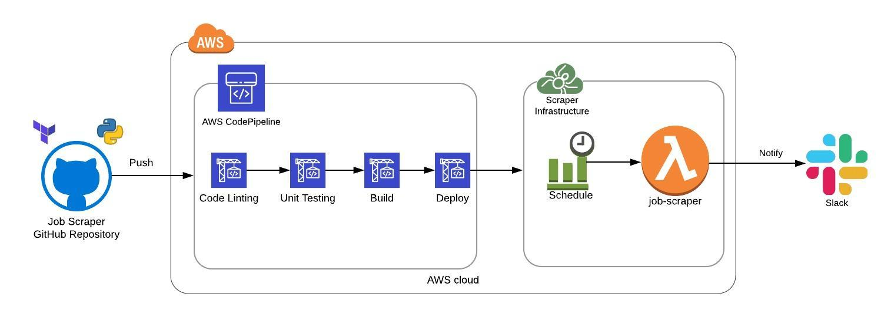
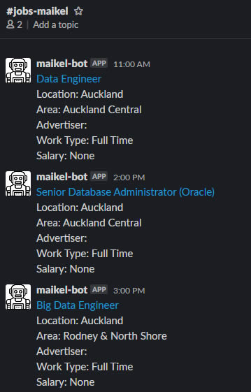

# Job Scraper

This project collects new Job Listings from this [website](https://www.seek.co.nz/) and notify about them via slack.

## Table of Contents  
[Architecture](#architecture)  
[Deployment](#deployment)  
<a name="architecture"/>
## Architecture

The Slack message:

&nbsp;<a name="deployment"/>
## Deployment

This repository is split into two parts:
* The Scraper code: `job_scraper` folder.
* The CI/CD pipeline: responsible for deploying the scraper and pushing changes to the code, which lives inside `cicd_infrastructure`.

 

### .: Prerequisites: :.
You need the following to deploy the project:
* [Terraform](https://www.terraform.io/downloads.html)
* [AWS account](https://aws.amazon.com/premiumsupport/knowledge-center/create-and-activate-aws-account/) 
* [AWS Cli](https://docs.aws.amazon.com/cli/latest/userguide/install-cliv2.html)
* [AWS Profile](https://docs.aws.amazon.com/cli/latest/userguide/cli-chap-configure.html#cli-quick-configuration)
     &nbsp;&nbsp;&nbsp;This creates a profile with keys to access the AWS account
* [Slack Workspace](https://slack.com/create#email) 
* [Slack App](https://api.slack.com/apps?new_app=1)

 

### .: Installation & Configuration: :.

**1 - Slack**

* [Create a slack channel to receive jobs notifications](https://slack.com/intl/en-nz/help/articles/201402297-Create-a-channel)
* [Create a slack webhook from your Slack App](https://api.slack.com/apps/AV4KE26U9/incoming-webhooks?)
     &nbsp;&nbsp;&nbsp;Save the generated webhook url somewhere as you will need to use it later

 

**2 - AWS**

* [Create bucket to store deployment artifacts](https://docs.aws.amazon.com/AmazonS3/latest/gsg/CreatingABucket.html)
* [Store slack webhook on secrets manager](https://docs.aws.amazon.com/secretsmanager/latest/userguide/tutorials_basic.html#tutorial-basic-step1)
     &nbsp;&nbsp;&nbsp;I create a "Other type of secrets" and put the name of the secret and the Secret key the same.
     &nbsp;&nbsp;&nbsp;E.g:
         &nbsp;&nbsp;&nbsp;Secret Name: mpenz-ws-slack-webhook
         &nbsp;&nbsp;&nbsp;Secret Key: mpenz-ws-slack-webhook
         &nbsp;&nbsp;&nbsp;Secret Value: https://hooks.slack.com/services/....

 

**3 - Github**

* [Clone the Repository](https://help.github.com/en/github/creating-cloning-and-archiving-repositories/cloning-a-repository)
* [Create personal Access Token](https://docs.aws.amazon.com/codepipeline/latest/userguide/GitHub-create-personal-token-CLI.html)
     &nbsp;&nbsp;&nbsp;This is needed to allow your AWS account to connect with your clone github repo.
    Follow from step 1 to 6.
    Make sure you save it somewhere safe but with quick access.

 

**4 - Configure cloned repository**

<table>
  <tr>
    <th>File</th>
    <th>Variable</th>
    <th>Description</th>
  </tr>
  <tr>
    <td>cicd_infrastructure\terraform-backend.tfvars</td>
    <td>region</td>
    <td>target AWS Region where to deploy the infrastructure</td>
  </tr>
  <tr>
    <td></td>
    <td>profile</td>
    <td>AWS Profile name configured on your computer</td>
  </tr>
  <tr>
    <td></td>
    <td>bucket</td>
    <td>Deployment artifacts. Created as part of (2 - AWS)</td>
  </tr>
  <tr>
    <td>cicd_infrastructure\terraform-deployment.tfvars</td>
    <td>aws_region</td>
    <td>target AWS Region where to deploy the infrastructure</td>
  </tr>
  <tr>
    <td></td>
    <td>aws_profile</td>
    <td>AWS Profile name configured on your computer</td>
  </tr>
  <tr>
    <td></td>
    <td>artifacts_bucket</td>
    <td>Deployment artifacts. Created as part of (2 - AWS)</td>
  </tr>
  <tr>
    <td></td>
    <td>github_repository_owner</td>
    <td>your github account (as you cloned the repository)</td>
  </tr>
  <tr>
    <td></td>
    <td>github_repository_name</td>
    <td>job-scraper</td>
  </tr>
  <tr>
    <td>serverless.yml</td>
    <td>deploymentBucket</td>
    <td>Deployment artifacts. Created as part of (2 - AWS)</td>
  </tr>
</table>

 

### .: Deploy CI/CD pipeline: :.

